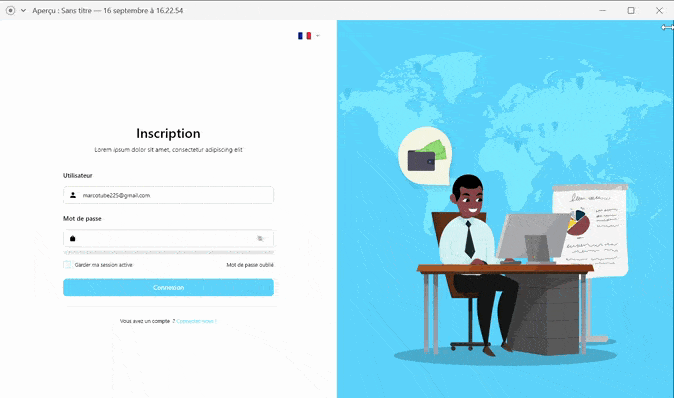

# @diama/password-strength-checker
An Angular library to check input password field strength and return invalid or valid statement with animated bar color.

this library has been built with no dependencies to provide an easy way to use it.

tested with karma and jasmine

# Demo


## Versions

| Angular| version|
| ------|:------:| 
| >= 5.0.0 < 13.0.0 | v1.x |

## Getting started

### Step 1: Installing

#### NPM

```shell
npm install --save @diama/password-strength-checker
```

#### YARN

```shell
yarn add @diama/password-strength-checker
```

### Step 2: Import the PasswordStrengthCheckerModule and angular FormsModule module and also ReactiveFormsModule for using it in reactive forms

```js
import {FormsModule, ReactiveFormsModule} from "@angular/forms";
import {PasswordStrengthCheckerModule} from "password-strength-checker";

@NgModule({
  declarations: [AppComponent],
  imports: [
    PasswordStrengthCheckerModule,
    ReactiveFormsModule,
    FormsModule],
  bootstrap: [AppComponent]
})
export class AppModule {
}
```

### Usage

Define options in your consuming component:

```js
@Component({...})
export class ExampleComponent {
  password = new FormControl('', [Validators.required]);
  myRegex = /^\d+$/;
}
```

In template use `password-strength-checker` component with your options

```html
<!--Using ng-option and for loop-->
<form>
  <div>
    <label for="password"> Password</label>
    <input type="password" id="password" [formControl]="password" autocomplete="off">
  </div>
  <password-strength-checker [requiredLength]="8" [password]="password.value" [regexPattern]="myRegex"></password-strength-checker>
</form>
```

## API

### Inputs

| Input  | Type | Default | Required | Description |
| ------------- | ------------- | ------------- | ------------- | ------------- |
| password | `string` | `` | yes | password value to evaluate strength |
| requiredStrength | `number` | 8 | no | a required min length of the password passed has input|
| barColors | `string[]` |  `['#FF0000', '#FF7700', '#0CC124']` | no | update the bar color to display in UI, first color is for error output,second for password which match perfectly with required length but not with your regex pattern and the last for password which match perfectly with your standard defined |
| regexPattern | `Regexp` | `/^[a-zA-Z]+$/` | no | if you want more complexity , its check if password contain some characters that you will define with your regex |
| feedbacks  | `{errorText: string, mediumText: string, successText: string}` | `{ errorText: 'Must have at least 8 characters', mediumText: 'Add special characters or number', successText: 'Good password'}` | no | to custom output message to show to the user |
